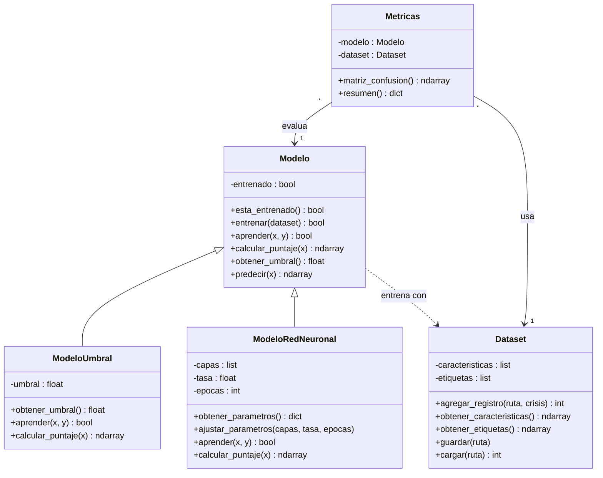

# Diagrama de clases

```mermaid
classDiagram
    direction TB

    class Dataset {
        -caracteristicas : list
        -etiquetas : list
        +agregar_registro(ruta, crisis) int
        +obtener_caracteristicas() ndarray
        +obtener_etiquetas() ndarray
        +guardar(ruta)
        +cargar(ruta) int
    }

    class Modelo {
        -entrenado : bool
        +esta_entrenado() bool
        +entrenar(dataset) bool
        +aprender(x, y) bool
        +calcular_puntaje(x) ndarray
        +obtener_umbral() float
        +predecir(x) ndarray
    }

    class ModeloUmbral {
        -umbral : float
        +obtener_umbral() float
        +aprender(x, y) bool
        +calcular_puntaje(x) ndarray
    }

    class ModeloRedNeuronal {
        -capas : list
        -tasa : float
        -epocas : int
        +obtener_parametros() dict
        +ajustar_parametros(capas, tasa, epocas)
        +aprender(x, y) bool
        +calcular_puntaje(x) ndarray
    }

    class Metricas {
        -modelo : Modelo
        -dataset : Dataset
        +matriz_confusion() ndarray
        +resumen() dict
    }

    Modelo <|-- ModeloUmbral
    Modelo <|-- ModeloRedNeuronal
    Modelo ..> Dataset : entrena con
    Metricas "*" --> "1" Modelo : evalua
    Metricas "*" --> "1" Dataset : usa
```

Leyenda: `-` atributo privado (`__` en Python), `+` método público, triángulo vacío = herencia, flecha punteada = dependencia, flecha continua = asociación, `*` = varias.
